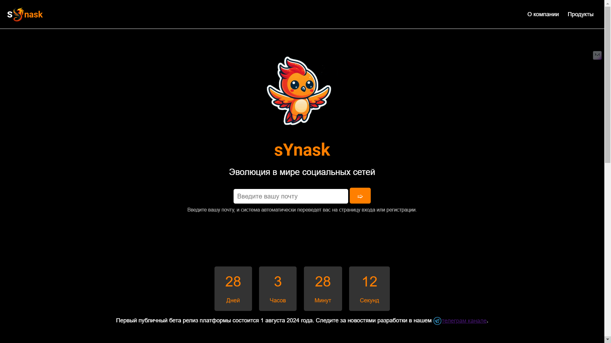
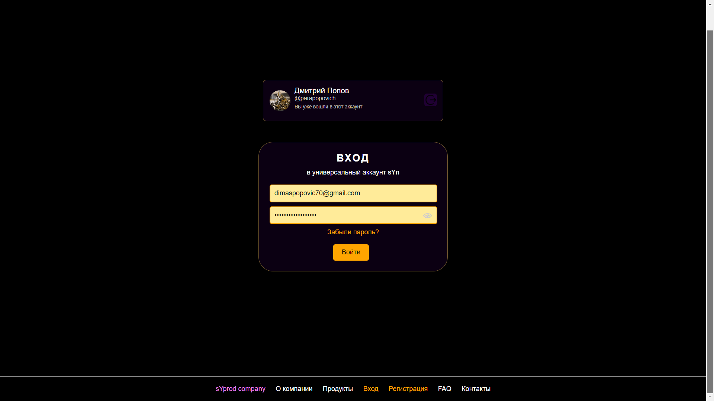
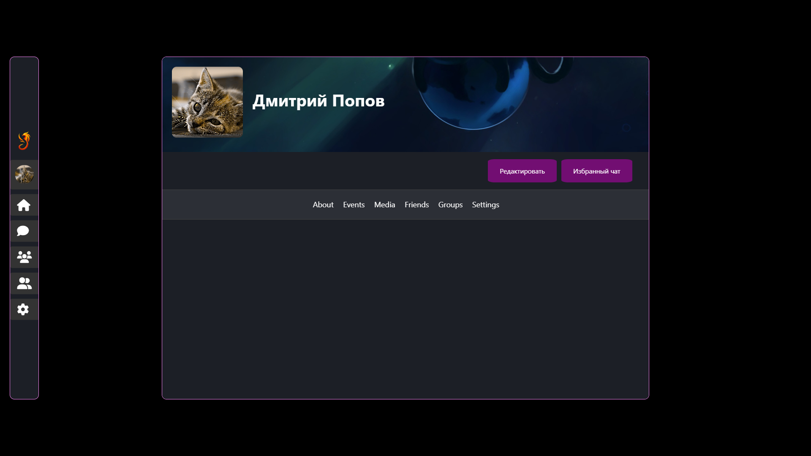

# Официальный репозиторий социальной сети sYnask

## Описание проекта

Добро пожаловать в официальный репозиторий веб-версии социальной сети sYnask от компании syprod. Этот репозиторий содержит исходный код веб-версии проекта sYnask. Код защищен базовой лицензией о защите прав, что означает отсутствие открытой лицензии. Код принадлежит исключительно компании syprod и социальной сети sYnask, и его нельзя модифицировать, изменять или использовать. Эти меры приняты для предотвращения кражи личных данных пользователей.

Проект написан на [React.js](https://reactjs.org/), что обеспечивает высокую производительность и гибкость при разработке.

## Скриншоты

*Официальный сайт*

*Страница входа*

*Страница профиля*

## Доступные ветки репозитория

- `main` - Основная ветка с последними стабильными релизами.
- `dev` - Ветка с официальным исходным кодом веб-версии проекта.
- `gh-pages` - Ветка с настоящей версией билда (release) по me.synask.ru.

## Доменная информация

- Домен социальной сети: [me.synask.ru](https://me.synask.ru)
- Домен описания продукта: [synask.syprod.ru](https://synask.syprod.ru)
- Домен с официальным сайтом, новостями и т.д.: [synask.ru](https://synask.ru)

## Поддержка и обратная связь

- Телеграм-канал: [t.me/synask](https://t.me/synask)

## Дополнительная информация

Открытые репозитории могут быть доступны для десктоп и андроид версий приложения (возможно в будущем). Веб-версия работает на ПК и других устройствах, однако пока что нет оптимизации для телефонов.

## О компании

sYnask — дочерний сервис компании syprod, который предоставляет универсальный аккаунт syn для всех своих сервисов. Став частью экосистемы syprod, sYnask стремится к безопасности и удобству пользователей, предоставляя им качественные услуги в области социальной сети.

---

Для получения дополнительной информации посетите наш [официальный сайт](https://synask.ru).
